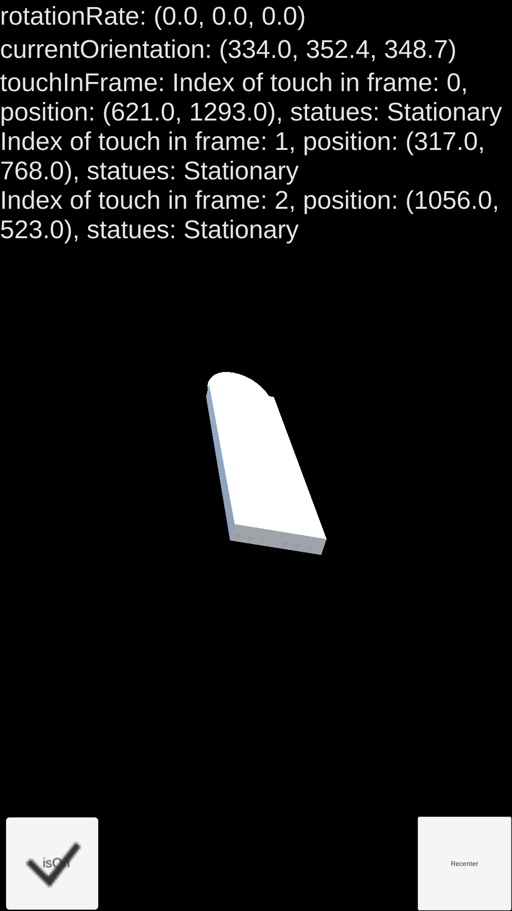

# Last update: 2018/04/04
## GyroScope, Touch Controller
* Added the touch_event into the last days' work
###About the `GUILayout` informations
* rotationRate is currently in radians/seconds, return float is in high enough resolution but didn't print out
* currentRotation refers to the calculation results, can be a reference, `quaterion` is easy to get inside the Unity, but didn't print out here
* touch events includes
  * Multitouch support, the index refers to `touch[n]` in unity
  * Positon refers to the (x,y) in screen space, left-down corner = (0,0), absolutely based on screen pixel
  * The printed states are the enums of `touchPhase` provided by Unity, with five states as: `Began`, `Moved`, `Stationary`, `Ended`, `Canceled`, details can be found in the link [here](https://docs.unity3d.com/ScriptReference/TouchPhase.html)
  

## 2018/04/03
## GyroScope Controller
* Build Scene/GyroScope_Rotation.unity into any Targeted Android phones
  * High FPS performance
  * the toggle in the left down corner is for open/close gyro, and the button in the right down corner is for recenter the targeted object
  * Calling `Input.gyro.rotationRate` instead of `Input.gyro.attitude`, in which will boost the application because of some idoit issues from Unity to Android
* For Zhenyi if next steps is needed
  * Recommanded to broadcast the `Vector3 rotationRate`, and calculate the `Rotation` inside the client server, by using `Transform.rotate()` methods
  * Recenter will be easy to do, by directly recenter the target object, instead of operate some Quaternion, which will always have some issue in the math side
## Next Steps
* 2D drawing traces array, rendering in screen first
